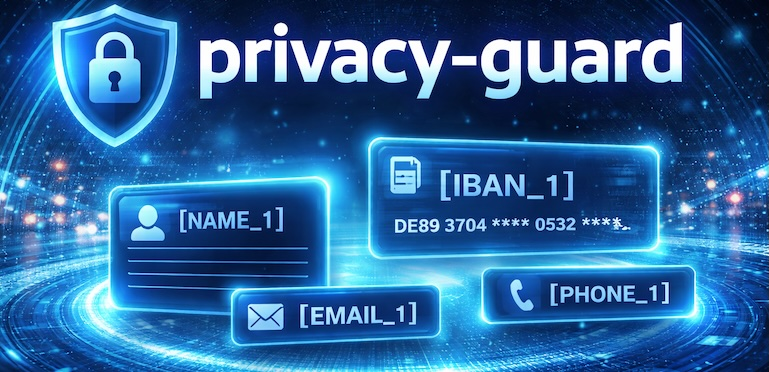
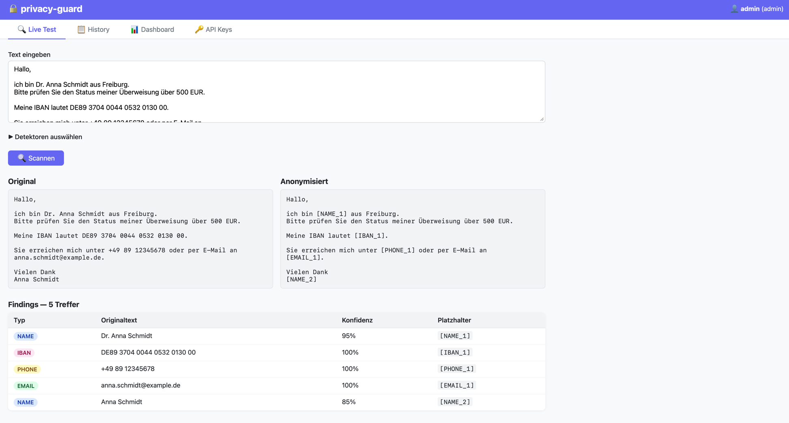

# privacy-guard

[](https://pypi.org/project/privacy-guard-scanner/)
[](https://pypi.org/project/privacy-guard-scanner/)
[](https://github.com/adrian-lorenz/privacy-guard/blob/main/LICENSE)
[](https://github.com/adrian-lorenz/privacy-guard/actions/workflows/release.yml)
[](https://github.com/adrian-lorenz/privacy-guard/actions/workflows/release.yml)
[](https://github.com/adrian-lorenz/privacy-guard/actions/workflows/docker.yml)
[](https://hub.docker.com/r/noxway/privacy-guard)

**GDPR/DSGVO-compliant PII anonymisation for LLM workflows.**

`privacy-guard` reliably detects personal data in German-language text, replaces it with stable placeholders, and enables clean restoration after processing. No ML-inference overhead at runtime for most detectors — clear results, API-ready.



**Highlights**
- 🔒 Compliance-first: protect sensitive data before it reaches external LLMs
- 🌐 Built-in proxy: drop-in PII filter for Claude Code, Cursor, Continue.dev, OpenCode and any OpenAI-compatible tool
- ⚡ Runtime-friendly: regex/rule-based detectors without a heavy inference stack
- 🔁 Deterministic: stable placeholders plus lossless restoration
- 🐳 Deploy-ready: Python package and FastAPI/Docker available out of the box

## Why privacy-guard?

- Protects sensitive data **before** sending it to external models
- Replaces PII with deterministic placeholders such as `[NAME_1]`, `[IBAN_1]`
- Restores original values via `ScanResult.restore()`
- Resolves overlapping matches with priority logic (e.g. `SECRET > IBAN > SOCIAL_SECURITY > EMAIL > …`)
- Supports Python-package and FastAPI/Docker operation

## Detected PII Types

| Type | Example | Method |
|---|---|---|
| `NAME` | `Dr. Anna Schmidt` | spaCy NER (`de_core_news_sm`) |
| `IBAN` | `DE89 3704 0044 0532 0130 00` | Regex + ISO 7064 check digit |
| `CREDIT_CARD` | `4111 1111 1111 1111` | Regex + Luhn algorithm |
| `PERSONAL_ID` | `C22990047` | Regex — Personalausweis & Reisepass (same format) |
| `SOCIAL_SECURITY` | `12 345678 X 123` | Regex — Rentenversicherungsnummer |
| `KVNR` | `T123456780` | Regex + §290 SGB V modified-Luhn check digit |
| `TAX_ID` | `12 345 678 903` | Regex + mod-11 check digit (§ 139b AO) |
| `VAT_ID` | `DE123456789` | Regex — Umsatzsteuer-Identifikationsnummer |
| `PHONE` | `+49 89 12345678` | Regex — DACH formats |
| `EMAIL` | `kontakt@example.de` | Regex |
| `ADDRESS` | `Hauptstraße 12, 79100 Freiburg` | Regex built from data files |
| `LICENSE_PLATE` | `B-AB 1234`, `HH-XY 12E` | Regex — Kfz-Kennzeichen inkl. E/H-Suffix |
| `DRIVER_LICENSE` | `MU010185A1` | Regex + Kontext-Fenster (±200 Zeichen) |
| `SECRET` | AWS key, GitHub PAT, … | 100+ pattern rules (TOML) |
| `URL_SECRET` | `?token=abc123def456` | Regex — query parameter values |

**Overlap priority:** `SECRET = URL_SECRET > IBAN = CREDIT_CARD = SOCIAL_SECURITY = KVNR > PERSONAL_ID = TAX_ID = VAT_ID = EMAIL = DRIVER_LICENSE > PHONE = LICENSE_PLATE > ADDRESS > NAME`

Public figures are excluded from masking by default via an internal whitelist (~1,000 entries).

## Installation

### Python Package

```bash
pip install privacy-guard-scanner
```

The name detector requires a spaCy model:

```bash
pip install "de_core_news_sm @ https://github.com/explosion/spacy-models/releases/download/de_core_news_sm-3.8.0/de_core_news_sm-3.8.0-py3-none-any.whl"
# or:
python -m spacy download de_core_news_sm
```

### API Stack (local)

```bash
pip install -e ".[api]"
uvicorn api.main:app --reload --port 8000
```

## Quickstart (Python)

```python
from privacy_guard import PrivacyScanner

scanner = PrivacyScanner()

result = scanner.scan(
    "Bitte überweise 500 EUR an Hans Müller, "
    "IBAN DE89 3704 0044 0532 0130 00. "
    "Rückfragen an h.mueller@example.de oder +49 89 123456."
)

print(result.anonymised_text)
# Bitte überweise 500 EUR an [NAME_1], IBAN [IBAN_1]. Rückfragen an [EMAIL_1] oder [PHONE_1].

print(result.mapping)
# {'[NAME_1]': 'Hans Müller', '[IBAN_1]': 'DE89 3704 0044 0532 0130 00', ...}

llm_answer = "Vielen Dank, [NAME_1]. Die Daten zu [IBAN_1] sind verarbeitet."
print(result.restore(llm_answer))
# Vielen Dank, Hans Müller. Die Daten zu DE89 3704 0044 0532 0130 00 sind verarbeitet.
```

## Configuring the Scanner

```python
from privacy_guard import PiiType, PrivacyScanner

scanner = PrivacyScanner(extra_whitelist_names=["Erika Musterfrau"])
scanner.disable_detector(PiiType.NAME)
scanner.enable_detector(PiiType.NAME)

result = scanner.scan("Contact: erika@example.de")
```

Filtering specific findings:

```python
from privacy_guard import PiiType

secrets = [f for f in result.findings if f.pii_type == PiiType.SECRET]
for finding in secrets:
    print(finding.rule_id, finding.text, finding.confidence)
```

## Proxy — Transparent PII Filter for AI Coding Tools

privacy-guard includes an **OpenAI- and Anthropic-compatible reverse proxy** that anonymises every request before it reaches the cloud and optionally re-identifies placeholders in the response. No code changes required in your tools.

### Quick Setup

**1. Start privacy-guard**

```bash
uvicorn api.main:app --port 8000
# → http://localhost:8000
```

**2. Open the Proxy tab** and enter your API key(s) + enable the toggles.

**3. Point your tool at the proxy**

| Tool | Setting |
|---|---|
| **Claude Code** | `ANTHROPIC_BASE_URL=http://localhost:8000/proxy` |
| **Cursor** | `OPENAI_BASE_URL=http://localhost:8000/proxy` in settings |
| **Continue.dev** | `apiBase: http://localhost:8000/proxy/v1` |
| **OpenCode** | `"baseURL": "http://localhost:8000/proxy/v1"` in provider config |
| **Open WebUI** | Custom OpenAI API base URL field |

For **Claude Code** the setting can be made permanent in `~/.claude/settings.json`:

```json
{
  "env": {
    "ANTHROPIC_BASE_URL": "http://localhost:8000/proxy"
  }
}
```

### Proxy Endpoints

| Endpoint | Protocol | Used by |
|---|---|---|
| `POST /proxy/v1/messages` | Anthropic Messages API | Claude Code |
| `POST /proxy/v1/chat/completions` | OpenAI Chat Completions API | Cursor, Continue.dev, OpenCode, … |

### How It Works

```
Your tool → privacy-guard proxy → [PII scan + anonymise] → real API
                                ← [re-identify in response] ←
```

1. Every message (including `system`) is scanned — PII is replaced with placeholders like `[NAME_1]`, `[EMAIL_1]`
2. The anonymised request is forwarded to the real API with your configured key
3. Placeholders in the response are replaced back with the originals (opt-in)
4. Every request is logged in the **Proxy** tab with detected PII types, latency and status

### Proxy Configuration

All settings are managed in the **🌐 Proxy** tab of the web UI:

| Setting | Description |
|---|---|
| **OpenAI API Key** | Forwarded as `Authorization: Bearer` |
| **Anthropic API Key** | Forwarded as `x-api-key` (for `/v1/messages`) |
| **Anonymise requests** | Scan and mask PII before forwarding |
| **Re-identify responses** | Replace placeholders back in the LLM response |
| **Proxy active** | Master switch — disable without losing config |

---

## Web UI

The API server includes a built-in HTMX interface — no separate process, no CDN dependencies.



```bash
uvicorn api.main:app --reload
# → http://localhost:8000
```

### Login

An `admin` account with password `admin` is created by default (change via `UI_ADMIN_PASSWORD`).
After login the following tabs are available:

| Tab | Description |
|---|---|
| **Live Test** | Enter text, select detectors, run a scan — view original and anonymised text side by side |
| **History** | All your own scans (admins see all users); click a row to see finding details |
| **Dashboard** | Overall statistics, PII-type bar chart, scans-per-day line chart (Chart.js) |
| **Proxy** | Configure and monitor the transparent PII proxy; live request log |

Admins additionally see the **API Keys** tab.

### API Key Management (Admin)

Use the **🔑 API Keys** tab to create and revoke any number of API keys:

1. Enter a name → **Generate key**
2. Copy the full key (`pg_…`) — it is shown only once
3. Only the SHA-256 hash is stored; the prefix (`pg_xxxxxxxxx…`) remains visible
4. Keys can be revoked individually at any time

The key set via the `API_KEY` environment variable remains valid in parallel (backwards compatibility).

## REST API (Docker)

```bash
docker run -p 8000:8000 noxway/privacy-guard:latest
```

Or via Compose:

```bash
docker compose up
```

### Endpoints

| Method | Path | Description |
|---|---|---|
| `GET` | `/health` | Liveness check |
| `POST` | `/scan` | Full scan (findings + mapping + anonymised text) |
| `POST` | `/anonymize` | Return anonymised text only |

### Request Body

```json
{
  "text": "Hans Müller, IBAN DE89370400440532013000",
  "detectors": ["IBAN", "EMAIL"],
  "whitelist": ["Hans Müller"]
}
```

### Example with `curl`

```bash
curl -X POST http://localhost:8000/scan \
  -H "Content-Type: application/json" \
  -d '{"text": "Contact: hans@example.de, IBAN DE89370400440532013000", "detectors": ["EMAIL", "IBAN"]}'
```

With API key authentication:

```bash
curl -X POST http://localhost:8000/scan \
  -H "Content-Type: application/json" \
  -H "X-API-Key: pg_…" \
  -d '{"text": "hans@example.de"}'
```

## Configuration

| Variable | Default | Description |
|---|---|---|
| `API_KEY` | empty | If set, `X-API-Key` must be sent with every request (env-var key or DB key) |
| `CORS_ORIGINS` | `*` | Comma-separated origins, e.g. `https://app.example.com` |
| `UI_DB_PATH` | `ui.db` | Path to the SQLite database (users, scans, API keys) |
| `UI_ADMIN_PASSWORD` | `admin` | Password for the automatically created admin account |

Example:

```yaml
services:
  api:
    image: noxway/privacy-guard:latest
    ports:
      - "8000:8000"
    environment:
      API_KEY: my-secret-key
      CORS_ORIGINS: https://app.example.com
      UI_DB_PATH: /data/ui.db
      UI_ADMIN_PASSWORD: secure123
    volumes:
      - ui_data:/data

volumes:
  ui_data:
```

## Roadmap Ideas

- Improved entity recognition for DACH address variants
- Optional audit logging for compliance reports
- Extended multilingual support beyond German
- Check-digit validation for Personalausweis/Reisepass

## License

MIT. See [LICENSE](LICENSE).
