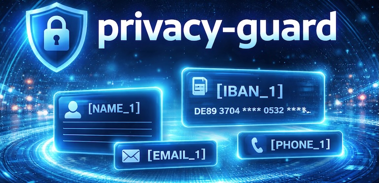
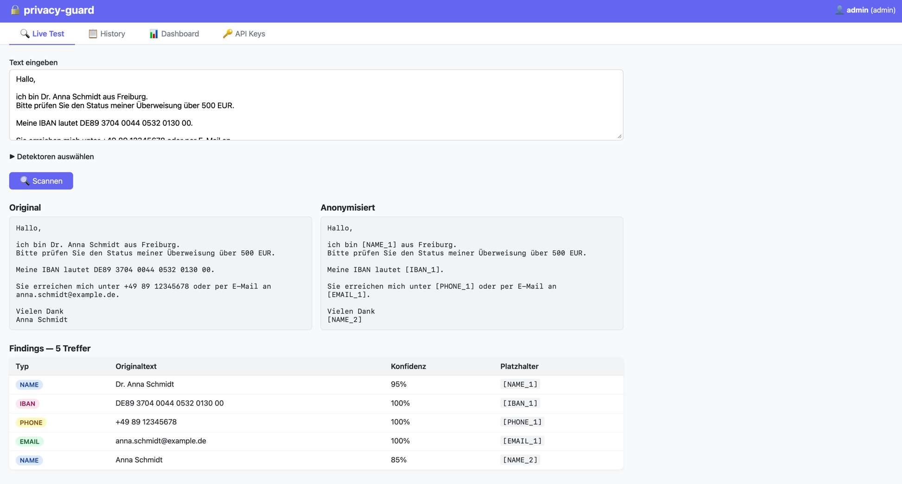

# privacy-guard

[](https://pypi.org/project/privacy-guard-scanner/)
[](https://pypi.org/project/privacy-guard-scanner/)
[](https://github.com/adrian-lorenz/privacy-guard/blob/main/LICENSE)
[](https://github.com/adrian-lorenz/privacy-guard/actions/workflows/release.yml)
[](https://github.com/adrian-lorenz/privacy-guard/actions/workflows/release.yml)
[](https://github.com/adrian-lorenz/privacy-guard/actions/workflows/docker.yml)
[](https://hub.docker.com/r/noxway/privacy-guard)

**DSGVO/GDPR-konforme PII-Anonymisierung für LLM-Workflows**.

`privacy-guard` erkennt personenbezogene Daten zuverlässig in deutschem Text,
ersetzt sie durch stabile Platzhalter und ermöglicht eine saubere Rückführung nach der Verarbeitung.
Kein ML-Inference-Overhead zur Laufzeit für die meisten Detektoren, klare Ergebnisse, API-ready.



**Highlights**
- 🔒 Compliance-first: Schutz sensibler Daten vor externen LLMs
- ⚡ Runtime-freundlich: Regex/Regel-Detektoren ohne schweren Inference-Stack
- 🔁 Deterministisch: stabile Platzhalter plus verlustfreie Rückführung
- 🐳 Deploy-ready: Python Package und FastAPI/Docker sofort nutzbar

## Warum privacy-guard?

- Schützt sensible Daten **vor** dem Versand an externe Modelle
- Ersetzt PII durch deterministische Platzhalter wie `[NAME_1]`, `[IBAN_1]`
- Stellt Originalwerte mit `ScanResult.restore()` wieder her
- Löst überlappende Treffer mit Prioritätslogik (z. B. `SECRET > IBAN > SOCIAL_SECURITY > EMAIL > ...`)
- Unterstützt Python-Package und FastAPI/Docker-Betrieb

## Erfasste PII-Typen

| Typ | Beispiel | Methode |
|---|---|---|
| `NAME` | `Dr. Anna Schmidt` | spaCy NER (`de_core_news_sm`) |
| `IBAN` | `DE89 3704 0044 0532 0130 00` | Regex + ISO-7064-Prüfziffer |
| `CREDIT_CARD` | `4111 1111 1111 1111` | Regex + Luhn-Algorithmus |
| `PERSONAL_ID` | `C22990047` | Regex — Personalausweis & Reisepass (gleiches Format) |
| `SOCIAL_SECURITY` | `12 345678 X 123` | Regex — Rentenversicherungsnummer |
| `KVNR` | `T123456780` | Regex + § 290 SGB V modifizierte Luhn-Prüfziffer |
| `TAX_ID` | `12 345 678 903` | Regex + mod-11-Prüfziffer (§ 139b AO) |
| `VAT_ID` | `DE123456789` | Regex — Umsatzsteuer-Identifikationsnummer |
| `PHONE` | `+49 89 12345678` | Regex — DACH-Formate |
| `EMAIL` | `kontakt@example.de` | Regex |
| `ADDRESS` | `Hauptstraße 12, 79100 Freiburg` | Regex aus Daten-Dateien |
| `LICENSE_PLATE` | `B-AB 1234`, `HH-XY 12E` | Regex — Kfz-Kennzeichen inkl. E/H-Suffix |
| `DRIVER_LICENSE` | `MU010185A1` | Regex + Kontext-Fenster (±200 Zeichen) |
| `SECRET` | AWS-Key, GitHub-PAT, … | 100+ Musterregeln (TOML) |
| `URL_SECRET` | `?token=abc123def456` | Regex — Query-Parameter-Werte |

**Priorität bei überlappenden Treffern:** `SECRET = URL_SECRET > IBAN = CREDIT_CARD = SOCIAL_SECURITY = KVNR > PERSONAL_ID = TAX_ID = VAT_ID = EMAIL = DRIVER_LICENSE > PHONE = LICENSE_PLATE > ADDRESS > NAME`

Personen des öffentlichen Lebens werden per interner Whitelist (~1 000 Einträge) standardmäßig nicht maskiert.

## Installation

### Python Package

```bash
pip install privacy-guard-scanner
```

Für den Namensdetektor wird ein spaCy-Modell benötigt:

```bash
pip install "de_core_news_sm @ https://github.com/explosion/spacy-models/releases/download/de_core_news_sm-3.8.0/de_core_news_sm-3.8.0-py3-none-any.whl"
# oder:
python -m spacy download de_core_news_sm
```

### API-Stack lokal

```bash
pip install -e ".[api]"
uvicorn api.main:app --reload --port 8000
```

## Quickstart (Python)

```python
from privacy_guard import PrivacyScanner

scanner = PrivacyScanner()

result = scanner.scan(
    "Bitte überweise 500 EUR an Hans Müller, "
    "IBAN DE89 3704 0044 0532 0130 00. "
    "Rückfragen an h.mueller@example.de oder +49 89 123456."
)

print(result.anonymised_text)
# Bitte überweise 500 EUR an [NAME_1], IBAN [IBAN_1]. Rückfragen an [EMAIL_1] oder [PHONE_1].

print(result.mapping)
# {'[NAME_1]': 'Hans Müller', '[IBAN_1]': 'DE89 3704 0044 0532 0130 00', ...}

llm_answer = "Vielen Dank, [NAME_1]. Die Daten zu [IBAN_1] sind verarbeitet."
print(result.restore(llm_answer))
# Vielen Dank, Hans Müller. Die Daten zu DE89 3704 0044 0532 0130 00 sind verarbeitet.
```

## Scanner konfigurieren

```python
from privacy_guard import PiiType, PrivacyScanner

scanner = PrivacyScanner(extra_whitelist_names=["Erika Musterfrau"])
scanner.disable_detector(PiiType.NAME)
scanner.enable_detector(PiiType.NAME)

result = scanner.scan("Kontakt: erika@example.de")
```

Nur bestimmte Findings auswerten:

```python
from privacy_guard import PiiType

secrets = [f for f in result.findings if f.pii_type == PiiType.SECRET]
for finding in secrets:
    print(finding.rule_id, finding.text, finding.confidence)
```

## Web-UI

Der API-Server enthält eine integrierte HTMX-Oberfläche — kein separater Prozess, keine CDN-Abhängigkeiten.

```bash
uvicorn api.main:app --reload
# → http://localhost:8000
```

### Login

Standardmäßig wird ein `admin`-Account mit Passwort `admin` angelegt (über `UI_ADMIN_PASSWORD` änderbar).
Nach dem Login stehen drei Tabs zur Verfügung:

| Tab | Beschreibung |
|---|---|
| **Live Test** | Text eingeben, Detektoren auswählen, Scan starten — Original und anonymisierten Text nebeneinander sehen |
| **History** | Alle eigenen Scans (Admins sehen alle Nutzer); Klick auf eine Zeile zeigt Findings-Detail |
| **Dashboard** | Gesamtstatistiken, PII-Typ-Balkendiagramm, Scans-pro-Tag-Liniendiagramm (Chart.js) |

Admins sehen zusätzlich den Tab **API Keys**.

### API-Key-Verwaltung (Admin)

Über den Tab **🔑 API Keys** können beliebig viele API-Keys angelegt und gesperrt werden:

1. Name eingeben → **Key generieren**
2. Den vollständigen Key (`pg_…`) kopieren — er wird nur einmal angezeigt
3. Gespeichert wird ausschließlich der SHA-256-Hash; der Prefix (`pg_xxxxxxxxx…`) bleibt sichtbar
4. Keys können jederzeit einzeln gesperrt werden

Der über die Umgebungsvariable `API_KEY` gesetzte Key bleibt parallel gültig (Rückwärtskompatibilität).

## REST API (Docker)

```bash
docker run -p 8000:8000 noxway/privacy-guard:latest
```

Alternativ via Compose:

```bash
docker compose up
```

### Endpunkte

| Methode | Pfad | Beschreibung |
|---|---|---|
| `GET` | `/health` | Liveness-Check |
| `POST` | `/scan` | Vollständiger Scan (Findings + Mapping + anonymisierter Text) |
| `POST` | `/anonymize` | Nur anonymisierten Text zurückgeben |

### Request-Body

```json
{
  "text": "Hans Müller, IBAN DE89370400440532013000",
  "detectors": ["IBAN", "EMAIL"],
  "whitelist": ["Hans Müller"]
}
```

### Beispiel mit `curl`

```bash
curl -X POST http://localhost:8000/scan \
  -H "Content-Type: application/json" \
  -d '{"text": "Kontakt: hans@example.de, IBAN DE89370400440532013000", "detectors": ["EMAIL", "IBAN"]}'
```

Mit API-Key-Authentifizierung:

```bash
curl -X POST http://localhost:8000/scan \
  -H "Content-Type: application/json" \
  -H "X-API-Key: pg_…" \
  -d '{"text": "hans@example.de"}'
```

## Konfiguration

| Variable | Standard | Bedeutung |
|---|---|---|
| `API_KEY` | leer | Wenn gesetzt, muss `X-API-Key` mitgesendet werden (Env-Var-Key oder DB-Key) |
| `CORS_ORIGINS` | `*` | Kommagetrennte Origins, z. B. `https://app.example.com` |
| `UI_DB_PATH` | `ui.db` | Pfad zur SQLite-Datenbank (Nutzer, Scans, API-Keys) |
| `UI_ADMIN_PASSWORD` | `admin` | Passwort des automatisch angelegten Admin-Accounts |

Beispiel:

```yaml
services:
  api:
    image: noxway/privacy-guard:latest
    ports:
      - "8000:8000"
    environment:
      API_KEY: my-secret-key
      CORS_ORIGINS: https://app.example.com
      UI_DB_PATH: /data/ui.db
      UI_ADMIN_PASSWORD: sicher123
    volumes:
      - ui_data:/data

volumes:
  ui_data:
```

## Roadmap-Ideen

- Verbesserte Entitäten-Erkennung für Adressen in DACH-Varianten
- Optionales Audit-Logging für Compliance-Reports
- Erweiterte Mehrsprachigkeit über Deutsch hinaus
- Prüfziffernvalidierung für Personalausweis/Reisepass

## Lizenz

MIT. Details in [LICENSE](LICENSE).
